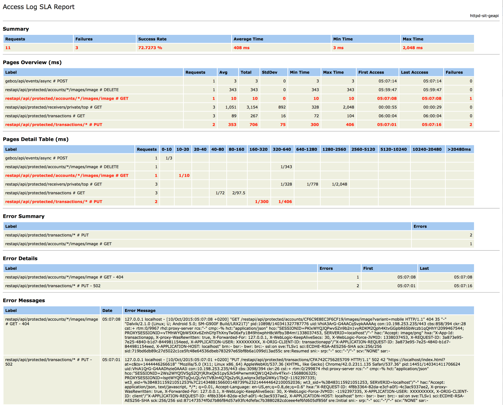

# 1. Introduction

This project contains a blue-print for parsing HTTP access logs and generating a SLA (Service Level Agreement) report. It is intended as blue-print project because
 
 * The format of access log files is highly configurable
 * Generation of the SLA report requires a collapsed URL (removing various ids found in the URL)
 * You might have custom requirements of skipping certain lines
 
Why would you need such a project - actually there should not be any need for such a tool
 
 * The production system is performance-tested so there are by definitions no excessive response times
 * A six-figure performance monitoring tool with 24x7 operation team is around which would spot any performance issues before they even happen
 * No customer has yet complained about slow response times so there can't be any performance issues

Having said that I sometimes like to question those assumptions

 * Analyzing access logs is low-tech since those files are always generated 
 * With a little bit of luck you can convince someone to copy a production access log
 * Adopting the Grok and regular expression is not trivial but can be done within an hour 

   
# 2. Design Consideration

## 2.1 Javascript versus Java

The actual program consists of a Javascript file executed by Nashorn using some Java libraries. 

Why not creating an all-in-one Java application
 
 * When you have gigabytes of access logs it is easier to move the script to the production server than the access logs to your computer
 * When you work on a remote server you only have SSH and some console-based editors
 * When you modify the script on the remote server you don't need a development infrastructure (IDE, Maven, ...)

## 2.2 Supporting Multiple Access Log Formats

Configuration of access logs are wildly different - there is no configuration to rule them all

Therefor the script supports multiple access logs formats

| Name                              | Description                                                                               |
|-----------------------------------|-------------------------------------------------------------------------------------------|
| common-apache                     | Common Apache log format                                                                  |
| combined-apache                   | Combined Apache access log                                                                |
| catalina-sit                      | Tomcat access log using sIT conventions                                                   |
| catalina-sit-geapi                | Tomcat access log using sIT conventions with George API filters                   		|
| catalina-sit-geimp                | Tomcat access log using sIT conventions with George Importer filters                      | 
| httpd-sit                         | Apache HTTPD log using sIT conventions                                                    |
| httpd-sit-geapi                   | Apache HTTPD log using sIT conventions with George API filters				            |
| haproxy                           | HAProxy log                                           								    |
| haproxy-sit-geapi                 | HAProxy log with George API filters                     								    |
| custom                            | Custom format to play around interactively                                                |
   
   
# 3. Usage

```
george-access-log-sla-report> ./access-log-sla-report.sh -h
usage: access-log-sla-report
 -h,--help           print this message
 -o,--output <arg>   output file for report
 -p,--parser <arg>   parser for access log
```

Execute the following command line parses a plain vanilla log file using "combined-apache" configuration

```
./access-log-sla-report.sh -p combined-apache ./src/test/data/apache/combined-access.log 
[INFO] Parsing the following number of file(s) : 1
[INFO] Parsing '/Users/sgoeschl/work/github/sgoeschl/access-log-sla-report/./src/test/data/apache/combined-access.log' containing 2000 lines took 495 ms
```

Execute the following command line parses some Apache HTTPD access logs using "httpd-sit-geapi" configuration

```
./access-log-sla-report.sh -p httpd-sit-geapi ./src/test/data/sit/httpd-access.log 
[INFO] Parsing the following number of file(s) : 1
[INFO] Parsing '/Users/sgoeschl/work/github/sgoeschl/access-log-sla-report/./src/test/data/sit/httpd-access.log' containing 13 lines took 131 ms
[INFO] The following number of lines were ignored : 1
```

Execute the following command line parses some Apache Tomcat access logs using "catalina-sit-geapi" configuration

```
./access-log-sla-report.sh -p catalina-sit-geapi ./src/test/data/sit/catalina-access.log
[INFO] Parsing the following number of file(s) : 1
[INFO] Parsing '/Users/sgoeschl/work/github/sgoeschl/access-log-sla-report/./src/test/data/sit/catalina-access.log' containing 24 lines took 123 ms
```

The application also supports compressed access logs

```
./access-log-sla-report.sh -p httpd-sit-geapi ./src/test/data/sit/httpd-access.log.bz2 
[INFO] Parsing the following number of file(s) : 1
[INFO] Parsing '/Users/sgoeschl/work/github/sgoeschl/access-log-sla-report/./src/test/data/sit/httpd-access.log.bz2' containing 11 lines took 124 ms
```

A more complex invocation picking up multiple access logs (and compressed logfiles)

```
./access-log-sla-report.sh -p httpd-sit-geapi -o my-report.html ./src/test/data/sit/httpd-access*
[INFO] Parsing the following number of file(s) : 3
[INFO] Parsing '/Users/sgoeschl/work/github/sgoeschl/access-log-sla-report/./src/test/data/sit/httpd-access.log' containing 13 lines took 137 ms
[INFO] The following number of lines were ignored : 1
[INFO] Parsing '/Users/sgoeschl/work/github/sgoeschl/access-log-sla-report/./src/test/data/sit/httpd-access.log.bz2' containing 11 lines took 14 ms
[INFO] Parsing '/Users/sgoeschl/work/github/sgoeschl/access-log-sla-report/./src/test/data/sit/httpd-access.log.gz' containing 11 lines took 13 ms

```

# 4. Building

Execute the following command line

```
access-log-sla-report> mvn clean install
```

It generates a 

 * access-log-sla-report-X.Y.Z-SNAPSHOT-dist.zip
 * access-log-sla-report-X.Y.Z-SNAPSHOT-dist.tar.gz
 
which can be unpacked at the remote server 

The integration test also creates a "./target/access-log-sla-report.html"

# 5. Understanding the HTML Report



Looking at the HTML report reveals the following information

* There were 11 HTTP requests captured 
* Some HTTP requests are shown in red color indicating that at least one error was detected
* The "Page Details Table" shows the response time sorted in various buckets
* ''restapi/api/protected/transactions # GET'' has 3 invocations whereas 2 invocations are in the bucket "80-160 ms" and the average response time of these requests is 97,5 milliseconds
* The section "Error Summary" shows that thwo endpoints reported errors
* The section "Error Details" gives you more information including the HTTP status code and when the errors were detected
   
   
# 6. Under The Hood
            
 * The Javascript is executed by Nashorn
 * The script reads the access logs line by line and each line is split into individual parts using Grok expressions
 * The individual parts are further processed to create "LogEntry" instances
 * A "LogEntry" instance contains a collapsed URL, a HTTP result code, a timestamp and a duration
 * This information is feed to [jmeter-sla-report](https://github.com/sgoeschl/jmeter-sla-report) which delegates the work to [JAMon](http://jamonapi.sourceforge.net)
 * After feeding all "LogEntry" instances to JAMon a HTML report is created
      

# 7. Software Requirements

## 7.1 Build

The following tools are required to build the project

* JDK 1.8
* Apache Maven 3.2.3 or better

## 7.2 Execution

The following tools are required to run the project

* JDK 1.8

# 8. Access Log Formats

## 8.1 Common Apache Access Log Format

```
%h              Remote hostname/IP [string]
%v              Canonical server name (vhost) [string]
%u              Remote user (if authenticated) [string]
%t              Request reception time [18/Sep/2011:19:18:28 -0400]
%r              First line of request [string]
%>s             Final request status [number]
%b              Response bytes excluding headers [string]
```

## 8.2 Combinded Apache Access Log Format

```
%h              Remote hostname/IP [string]
%v              Canonical server name (vhost) [string]
%u              Remote user (if authenticated) [string]
%t              Request reception time [18/Sep/2011:19:18:28 -0400]
%r              First line of request [string]
%>s             Final request status [number]
%b              Response bytes excluding headers [string]
%{Referer}i     Incoming Referer header [string]
%{User-Agent}i  Incoming UA header [string]
```

# 9. Some Thoughts Along The Line

## 9.1 Performance

The performance varies depending on the log file format, your custom regular expressions and your CPU power. We use cron job to parse access logs having usually around 5 million lines per day.

Below you find some ball park numbers

| Configuration                     | Computer		| Throughput                 |
|-----------------------------------|---------------|----------------------------|
| haproxy-sit-geapi                 | iMac i7 2011  |  9.0000 lines / sec        |
| combined-apache                   | iMac i7 2015  | 20.0000 lines / sec        |
